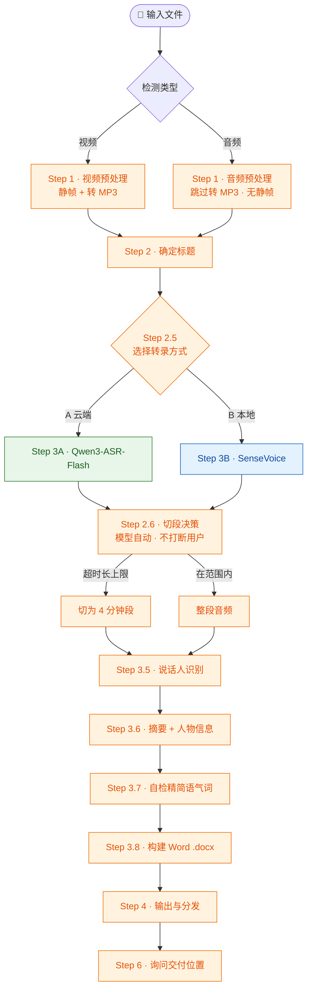

# 🎬 Interview Transcriber

> 采访视频一键转录技能 · 自动把视频变成**带说话人识别、内容摘要与人物信息**的结构化文档

[](https://www.python.org)
[](https://help.aliyun.com/zh/model-studio/)
[](https://modelscope.cn)
[](https://github.com)
[](#license)

给 Agent 一段采访视频，它会自动跑完 **预处理 → 转录 → 说话人识别 → 摘要与人物信息 → 输出文档**，最后还会问你「要把文档发到哪里」。你只需要在中间选一下转录方式。

## 📑 目录

- [功能概览](#功能概览)
- [安装](#安装)
- [快速开始](#快速开始)
- [使用说明](#使用说明)
- [工作流程](#工作流程)
- [输出文档结构](#输出文档结构)
- [Agent 兼容性](#agent-兼容性)
- [技术选型](#技术选型)
- [注意事项](#注意事项)
- [更新日志](#更新日志)

---

## ✨ 功能概览

| 功能 | 说明 |
|------|------|
| 🎞️ 输入预处理 | 视频：提取**最清晰静帧** + 转 MP3；音频：直接用作音频（跳过转 MP3、无静帧） |
| 🧩 多段合并 | 一个采访拆成多个文件？明确告知后自动合并转录为一篇文档 |
| ☁️ 云端转录 | Qwen3-ASR-Flash（可选升级，准确率最高），需 DashScope API Key |
| 💻 本地转录 | **默认** SenseVoice / Paraformer（魔搭社区，中文优秀，离线可用） |
| ⏱️ 对话时间码 | 每轮对话标注 `[MM:SS]`，精准定位视频位置 |
| 🗣️ 说话人识别 | LLM 语义分析，自动区分「采访者 / 受访人 / 其他角色」（支持多说话人） |
| 📝 内容摘要 | LLM 生成 3-5 句话概括采访核心内容 |
| 👤 人物信息 | LLM 提取受访人学校 / 专业 / 年级 / 家乡 / 经历 / 观点 |
| ✂️ 自检润色 | 生成后自动通读，适度精简口语语气词（不改原意） |
| 📤 多平台分发 | 本地 Word(.docx) / 钉钉文档 / 飞书 / Notion / 其他平台 |

---

## 📦 安装

把这个仓库链接直接发给你的 Agent，让它自动下载安装即可：

```
https://github.com/torylyj/interview-transcriber
```

安装完成后，在 Agent 对话中提到「转录采访视频」就会自动触发。

---

## 🚀 快速开始

### 前置条件

- **ffmpeg** — 视频处理。Windows 缺失时运行 `python scripts/setup_env.py` 自动从**国内镜像**（npmmirror 二进制镜像）下载静态构建；或用系统包管理器（choco / winget / brew）安装
- **Python 3.10+** — 运行转录脚本
- **DashScope API Key** — 云端转录必需（[获取地址](https://bailian.console.aliyun.com/?tab=model#/api-key)）
- **已无需 HuggingFace Token** — 说话人统一由 LLM 语义切分；模型仅 SenseVoice / Paraformer（魔搭社区国内直连），全程不碰 HuggingFace

### 安装依赖

> ⚠️ **务必走国内镜像**：直连国外 PyPI / GitHub 经常超时下载不动。推荐一条命令自动装好（含 ffmpeg）：

```bash
# 推荐：一键安装全部依赖 + 按需下载 ffmpeg（全国内镜像）
python scripts/setup_env.py
```

如需手动安装，也请指定国内 PyPI 镜像（以下任一）：

```bash
# 阿里云（推荐）｜ 清华 ｜ 腾讯云
PIP_MIRROR=https://mirrors.aliyun.com/pypi/simple

# 云端转录（推荐）
pip install -i $PIP_MIRROR dashscope

# 本地转录 — SenseVoice / Paraformer（推荐，模型从魔搭社区国内直连下载）
pip install -i $PIP_MIRROR funasr modelscope

# ⚠️ 以下两项已移出默认安装（不推荐、可省，无需装即可完成全流程）：
#   faster-whisper（~3GB 模型，中文一般，SenseVoice 已够用）
#   pyannote.audio（声纹分离，需 HF Token；说话人改由 LLM 语义切分）
#   若确有需要才装：pip install -i $PIP_MIRROR faster-whisper pyannote.audio

# Word 文档输出（.docx 直接生成，必需）
pip install -i $PIP_MIRROR python-docx pillow
```

> 也可走 `requirements.txt`：`pip install -i $PIP_MIRROR -r requirements.txt`

---

## 📖 使用说明

使用非常简单，**只需要告诉 Agent 你的视频或音频地址**，剩下的全部自动完成。

### 基本用法

```
# 视频
帮我转录这个采访视频：D:/videos/interview_001.mp4

# 音频（无需视频转 MP3，也不会提取静帧）
帮我转录这段采访录音：D:/audios/interview_001.m4a
```

Agent 收到后会自动执行完整流程，**默认使用本地转录（SenseVoice，离线可用、无需任何配置）**，不会打断你提问。

- 如果想要**更高的识别准确率**，随时告诉 Agent「用云端转录」（需 DashScope API Key），它会切换为 Qwen3-ASR-Flash。
- 如果**一个采访被拆成了多段视频/音频**，只需在开头说明「这 N 个文件是同一段采访」，Agent 会自动合并转录成一篇文档（静帧取各片段中最清晰的一帧）。

Agent 会根据所选模型的时长能力**自动决定是否切段**（云端超过 5 分钟必须切，本地长音频自动切、短音频整段，均不打断你确认），然后继续自动完成：**转录 → 说话人识别 → 生成摘要与人物信息 → 转为 Word 文档(.docx) → 自检精简语气词**，最后主动询问你要把文档发到哪里。

### 输出结果

最终生成的 **Word 文档（.docx）** 包含：

1. **人物静帧**（仅视频输入）— 视频中人物画面截图（居中显示）；音频输入时无此行
2. **内容摘要** — 3-5 句话概括采访核心内容
3. **人物信息** — 受访人学校 / 专业 / 年级 / 家乡 / 关键经历 / 核心观点
4. **采访记录** — 带说话人标签和时间码的逐句对话

### 常见用法示例

| 场景 | 示例指令 |
|------|---------|
| 转录并保存到本地 | `帮我转录 D:/video.mp4，保存到桌面` |
| 转录并上传钉钉文档 | `帮我转录这个视频并上传到钉钉文档：D:/video.mp4` |
| 转录音频录音 | `帮我转录这段录音：D:/audios/interview.m4a` |
| 多段合并采访 | `这段采访我分了 3 段：a.mp4 b.mp4 c.mp4，它们是同一段采访，帮我合并转录` |
| 转录多个视频 | `帮我批量转录 D:/videos/ 目录下的所有视频` |
| 只要转录文本 | `帮我转录 D:/video.mp4，不需要摘要和人物信息` |

### 首次使用准备

**云端转录**（推荐）需要配置 DashScope API Key：

```bash
# 获取地址：https://bailian.console.aliyun.com/?tab=model#/api-key
export DASHSCOPE_API_KEY="sk-your-key-here"
```

**本地转录**默认 SenseVoice 从魔搭社区下载，**全程无需 HuggingFace Token**——说话人统一由 LLM 语义切分（Step 3.5），不需要 pyannote.audio 声纹分离。

> 💡 **提示**：默认选 A（云端转录），准确率最高且费用极低；选 B 时默认使用 SenseVoice（中文质量接近云端，从魔搭社区下载，无需 HuggingFace）。

---

## 🔄 工作流程

<div align="center">



</div>

---

## 📄 输出文档结构

> 以下为文档内容结构；最终以 **Word 文档（.docx）** 形式交付，由 `scripts/build_docx.py` 直接读取结构化 JSON 生成，**全程无 Markdown 中间文件**。

```markdown
# <标题>

<!-- 视频输入时插入静帧，音频输入时无此行 -->
<div align="center">

</div>

## 📝 内容摘要
<LLM 生成的 3-5 句话概括>

## 👤 受访人信息
| 字段 | 内容 |
|------|------|
| 学校/单位 | ... |
| 专业/学院 | ... |
| 年级/身份 | ... |
| 家乡 | ... |
| 关键经历 | ... |
| 核心观点 | ... |

## 📋 文档信息
> 转录工具：Qwen3-ASR-Flash / SenseVoice
> 说话人识别：LLM 语义分析
> 摘要与人物信息：LLM 生成
> 转录日期：2026-07-09

## 💬 采访记录
**采访者** [00:00]
<对话内容>

**受访人** [00:15]
<对话内容>
...
```

---

## 🤖 Agent 兼容性

本技能以 Markdown 指令文件（`SKILL.md`）形式编写，不依赖任何特定平台。任何支持 bash 命令执行、文件读写、Python 脚本运行的 AI 编码代理均可使用：

| Agent | 加载方式 |
|-------|---------|
| **WorkBuddy** | 放置在 `~/.workbuddy/skills/` 目录，对话中自动触发 |
| **Claude Code** | 将 `SKILL.md` 内容追加到 `CLAUDE.md` 或通过自定义命令加载 |
| **Codex (OpenAI)** | 作为 `AGENTS.md` 或通过系统提示注入 |
| **Cursor** | 放入 `.cursorrules` 或项目上下文 |
| **其他 Agent** | 将 `SKILL.md` 作为系统提示或上下文注入即可 |

> **LLM 能力说明：** Step 3.5（说话人识别）和 Step 3.6（摘要生成）需要 LLM 能力。大多数编码代理（Claude Code、Codex、WorkBuddy 等）本身即是 LLM，可直接在对话中完成这两步，无需额外 API 调用。

---

## 🔧 技术选型说明

### 转录方式对比

| 对比项 | 云端 (Qwen3-ASR-Flash) | 本地 SenseVoice / Paraformer |
|--------|------------------------|-----------------------------|
| 中文准确率 | ⭐⭐⭐⭐⭐ | ⭐⭐⭐⭐ |
| 模型来源 | 阿里云 API | 魔搭社区（国内直连） |
| 模型大小 | 无需下载 | ~500MB / ~800MB |
| 说话人分离 | 不支持（需 LLM） | 不支持（需 LLM 语义切分，免 Token） |
| 网络 | 需要 | 不需要 |
| 成本 | 免费额度内极低 | 免费 |
| 推荐场景 | **日常使用（准确率最高）** | 无 API/离线场景 |

### 说话人识别方案

```
云端模式: Qwen3-ASR-Flash 连续文本 → LLM 语义切分 → 采访者/受访人
本地模式(SenseVoice/Paraformer): FunASR 转录 → LLM 语义切分 → 采访者/受访人（免 HF Token）
```

> 启发式方法（关键词+段落长度）已废弃，准确率不可接受。

### LLM 调用方式

| 方式 | 适用场景 | 说明 |
|------|---------|------|
| Agent 自身执行 | Claude Code、Codex、WorkBuddy 等 | Agent 本身即是 LLM，直接在对话中分析转录文本，无需额外 API 调用 |
| 调用外部 API | Agent 不便直接处理时 | 统一通过 `scripts/call_qwen.py` 调用 `dashscope.Generation.call(model='qwen-plus')`（详见 `references/dashscope_setup.md`） |

---

## ⚠️ 注意事项

- **文档命名规范**：`拍摄时间+人物简介`，如 `26-0509 车辆学院直博生`（人物简介 ≤10 字）
- **多段采访合并**：当一个采访被拆成多个视频/音频文件时，必须**明确告知哪几个文件属于同一段采访**，Agent 才会合并转录为一篇文档；未说明则每个文件各成一篇
- **智能静帧**：视频静帧由 `scripts/extract_frame.py` 均匀采样多帧、按清晰度比选最清晰的一张（避免黑屏/字幕遮挡帧）
- **默认本地转录**：默认 SenseVoice 离线可用、无需配置；仅当需要更高准确率或提供 DashScope API Key 时才切云端 Qwen3-ASR-Flash
- **时间码精度**：本地精确到秒；云端段内为估算值（4 分钟粒度），文档中已标注，请勿当作精确时间
- **Windows 路径**：使用正斜杠 `/`，避免中文路径传给 API
- **长文本处理**：LLM 单次输入建议不超过 8000 字符，超长需分段
- **在线文档上传**：部分平台 API 限制内容长度，超长文档需分段上传
- **本地转录质量**：SenseVoice / Paraformer（阿里达摩院中文模型）质量接近云端，从魔搭社区下载（国内直连，无需 HuggingFace，无需任何 Token）
- **说话人识别**：统一由 LLM 语义切分（Step 3.5），本地/云端一致；已移出 faster-whisper / pyannote.audio，默认安装仅需 5 个包

---

## 📝 更新日志

| 日期 | 内容 |
|------|------|
| 2026-07-11 | **精简依赖（默认仅 5 包）**：移出 faster-whisper（~3GB，中文一般）与 pyannote.audio（声纹分离，需 HF Token）；说话人统一改由 LLM 语义切分（免 Token）；`setup_env.py`/`requirements.txt` 默认仅装 funasr/modelscope/python-docx/pillow/dashscope，新增 `--extras` 可选项；所有外网下载改国内镜像（阿里云 PyPI / npmmirror 二进制 / 魔搭 / hf-mirror.com），ffmpeg 走 npmmirror 静态构建 |
| 2026-07-10 | **产品经理视角优化（P1–P9/P11 + 多段合并 + SKILL 瘦身）**：①新增多段采访合并说明（用户需明确告知哪些文件属同一采访，自动合并转录）；②P8 静帧改为 `extract_frame.py` 均匀采样多帧按清晰度比选最清晰帧；③P9 新增 `call_qwen.py` 统一文本任务 DashScope 调用，并补充版本兼容说明；④P11 全流程进度反馈（脚本阶段打印 + 指示 Agent 转述进度）；⑤P7 将 SKILL.md 由 808 行精简至 ~178 行，模型下载/切段命令/Prompt 模板/输出结构/错误处理等细节抽到 `references/`；⑥默认本地转录、云端仅作升级方案 |
| 2026-07-10 | **移除 Markdown 中间文件**：转录脚本直接输出结构化 `_transcript.json`，Agent 完成说话人识别/摘要/自检后写入 `_document.json`，由 `scripts/build_docx.py` 直接生成 .docx；删除 `md_to_docx.py`，全程不再生成任何 .md |
| 2026-07-10 | 最终交付改为 **Word 文档（.docx）**：转录与 LLM 处理后的中间 Markdown 经 `scripts/md_to_docx.py` 转换为 .docx，Step 5 清理时删除中间 .md；新增 Step 3.8 |
| 2026-07-10 | 新增 Step 3.7：文档生成后自检、适度精简口语语气词（不改原意、仅删明显冗余） |
| 2026-07-10 | 切段决策改为模型按能力自动处理，不再询问用户 |
| 2026-07-10 | 支持音频输入（跳过转 MP3、无静帧）；切段决策移至选完转录方式后的 Step 2.6；工作流图增加输入类型分支 |
| 2026-07-10 | 美化 README（hero 标题 + 徽章 + 目录 + 工作流图修正），文档预览同步最新输出格式 |
| 2026-07-10 | 新增 Step 6：全流程完成后主动询问用户交付位置 |
| 2026-07-10 | 修正本地转录前置条件说明（SenseVoice 无需 HuggingFace Token） |
| 2026-07-09 | README 新增「使用说明」章节，包含基本用法、输出结果、常见示例和首次准备 |
| 2026-07-09 | 本地转录新增多模型支持：SenseVoice / Paraformer（阿里达摩院中文模型，魔搭社区下载）+ faster-whisper large-v3，替代原 faster-whisper medium |
| 2026-07-09 | 新增 Step 2.5：转录前询问用户选择转录方式，明确告知本地转录质量差异 |
| 2026-07-09 | 新增对话时间码：每轮对话标注 [MM:SS]，云端段级精度，本地精确到秒 |
| 2026-07-09 | 适配多种 AI Agent（Claude Code、Codex 等）；统一使用"采访"表述 |
| 2026-07-09 | 新增 Step 3.6：LLM 生成内容摘要与人物信息，置于文档正文最前面 |
| 2026-07-01 | 初始版本：完整工作流程（预处理→转录→说话人识别→分发） |

---

## 📄 License

MIT
